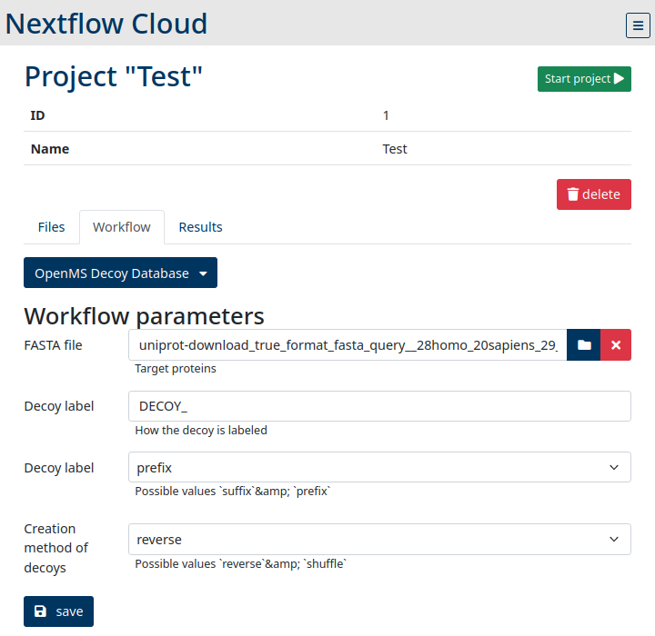

# Showcase: SDRF in workflows 

This repository is a showcase how multiple tools, developed by the ELIXIR protoemic community, are used to annotate a [dataset](https://www.ebi.ac.uk/pride/archive/projects/PXD011153) using Protoeimc-SDRF file and utilizing this file to complete configure a data analysis pipeline.   


## 1. SDRF creation
The SDRF was created with [lesSDRF](https://lessdrf.streamlit.app/). lesSDRF is a web-based tool which guides users through the process of creating a SDRF for their datasets.

## 2. Analyse pipeline
The pipline consists of three tool
* Identification: [X!Tandem](https://www.thegpm.org/tandem/)
* Validation: [PeptideShaker](http://compomics.github.io/projects/peptide-shaker)
* Quantification: [FlashLFQ](https://github.com/smith-chem-wisc/FlashLFQ)

All tools are configured mostly by using data from the create SDRF by using the Python module: [sdrf_convert](https://github.com/elixir-proteomics-community/sdrf_convert)
We manually converted the RAW-files to mzML, using ms-convert (peak picking enabled). [You download the mzML here](https://ruhr-uni-bochum.sciebo.de/s/ln0gqzgUMyqeb1s)


### Install
All tools and dependencies are installed using [Conda]()
```
conda env create -f environment.yaml
conda activate sdrf_usage_showcase
```

### Usage
```
mkdir -p tmp/mzml
# Download the mzml-archive, extract it and put the files into the folder
nextflow main.nf --sdrf $(pwd)/data/PXD011153.sdrf.tsv --fasta $(pwd)/data/ref_mus_musculus.fasta --mzml_dir $(pwd)/tmp/mzml --out_dir $(pwd)/tmp --maxed_missed_cleavages 2 --max_charge 4
```
Unfortunatly the workflow currently stops when firing up PeptideShaker

## Making it more easy!
To make our Nextflow-workflows better available, we created a web application called [NF-Cloud](https://github.com/mpc-bioinformatics/nf-cloud) to run the workflows directly in a cloud environment. The image below shows the settings of a decoy database creation workflow:


## Other projects using SDRF
Also [Wombat-P](https://github.com/wombat-p/WOMBAT-Pipelines) is heavily using SDRF in their pipelines.


